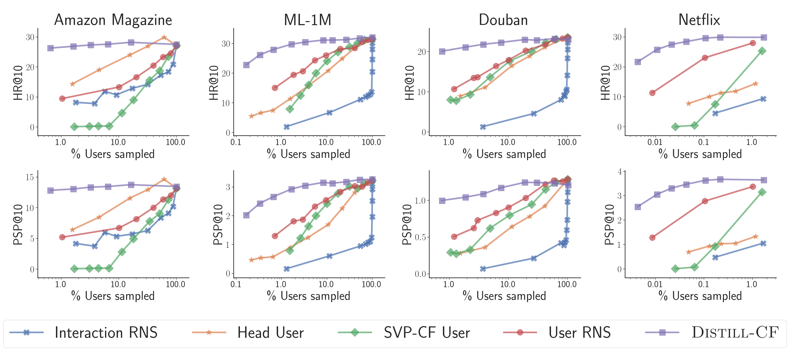

# Infinite Recommendation Networks: A Data-Centric Approach (Distill-CF)

This repository contains the implementation of Distill-CF (using ∞-AE) from the paper "Infinite Recommendation Networks: A Data-Centric Approach" [[arXiv]](https://arxiv.org/abs/2206.02626) where we leverage the NTK of an infinitely-wide autoencoder to perform data distillation i.e. instead of training models on large datasets, train them on terse, high-fidelity, and *synthetic* data summaries generated by Distill-CF. Notably, Distill-CF:
- Synthesizes *fake* users which are later used for model training
- Is easy to implement (<100 lines of relevant code)
- Converges in O(100) iterations
- Models trained only on 500 users generated by Distill-CF are enough to outperform SoTA models trained on the full dataset

The paper also proposes ∞-AE: a SoTA implicit feedback recommendation model that has a closed-form solution, and only a single hyper-parameter. We provide ∞-AE's code in a separate [GitHub repository](https://github.com/noveens/infinite_ae_cf).

If you find any module of this repository helpful for your own research, please consider citing the below under-review paper. Thanks!
```
@article{sachdeva2022b,
  title={Infinite Recommendation Networks: A Data-Centric Approach},
  author={Sachdeva, Noveen and Dhaliwal, Mehak Preet and Wu, Carole-Jean and McAuley, Julian},
  journal={arXiv preprint arXiv:2206.02626},
  year={2022}
}
```

**Code Author**: Noveen Sachdeva (nosachde@ucsd.edu)

---

## Setup
#### Environment Setup
```bash
pip install -r requirements.txt
```

#### Data Setup
Once you've correctly setup the python environment, the following script will download the ML-1M dataset and preprocess it for usage:

```bash
./prep.sh
```

---
## How to distill data?
- Edit the `hyper_params.py` file which lists all config parameters of Distill-CF.
- Finally, type the following command to train and evaluate ∞-AE on data synthesized by Distill-CF:
```bash
CUDA_VISIBLE_DEVICES=0 python distill.py
```
- Alternatively, to run a grid search on various hyper-parameters of Distill-CF, please edit the configuration (including GPU-ID) in `grid_search_distill.py` and then run:
```bash
python grid_search_distill.py
```

---
## Results sneak-peak

<br>


<center>Performance of ∞-AE with the amount of users (log-scale) sampled according to different
sampling strategies over the HR@10 and PSP@10 metrics. Results for the Netflix dataset have been
clipped due to memory constraints. Other results can be found in the <a href="https://arxiv.org/abs/2206.02626">paper</a>.</center>

<br><br>
Below are the nDCG@10 results for the datasets used in the [paper](https://arxiv.org/abs/2206.02626):

| Dataset           | PopRec  | MF    | NeuMF  | MVAE  | LightGCN    | EASE  | <center>∞-AE <br> (Full)</center> | <center>∞-AE <br> (Distill-CF)</center> |
| -------           | ------  | --    | -----  | ----  | --------    | ----  | ---------------- | ----------------- |
| Amazon Magazine   | 8.42    | 13.1  | 13.6   | 12.18 | 22.57       | 22.84 | 23.06            | **23.81**         |
| MovieLens-1M      | 13.84   | 25.65 | 24.44  | 22.14 | 28.85       | 29.88 | **32.82**        | 32.52             |
| Douban            | 11.63   | 13.21 | 13.33  | 16.17 | 16.68       | 19.48 | **24.94**        | 24.20             |
| Netflix           | 12.34   | 12.04 | 11.48  | 20.85 | *Timed out* | 26.83 | **30.59***       | 30.54             |

*Note*: The user synthesis budget for Distill-CF is only 500 for this table. ∞-AE's results on the Netflix dataset (marked with a *) are obtained by training only on 5% of the total users. Note however, all other methods are trained on the *full* dataset.

---

## MIT License
